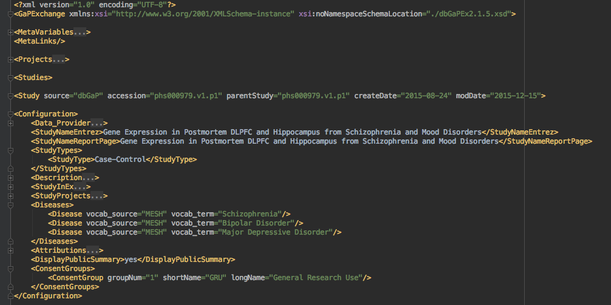

# dbgap

dbGaP to bioCADDIE metadata conversion utilities

## Introduction
This package contains a general utility that allows you to:

1. Download study metadata from the dbGaP ftp site by study id.
2. Convert the study metadata from XML into JSON
3. Transform the dbGaP JSON into a structure that is compatible with the bioCADDIE [study schema](https://github.com/biocaddie/WG3-MetadataSpecifications/blob/master/json-schemas/study_schema.json), [dataset schema](https://github.com/biocaddie/WG3-MetadataSpecifications/blob/master/json-schemas/dataset_schema.json) and [dimension schema](https://github.com/biocaddie/WG3-MetadataSpecifications/blob/master/json-schemas/dimension_schema.json)
4. Transform the bioCADDIE compatible JSON into RDF for use in mapping functions.
5. Transform RDF into bioCADDIE compatible JSON

## Installation

## Use

## Transformation description
### Downloading XML files
The utility allows any version of any study to be downloaded in XML from the dbGaP XML server

The default download directory is ```data/<studyid>/xml```.

As an example, 

```bash
(myenv) > download_study 979 d
```
Creates a ```data/phs000979/xml``` directory with the following files:

```
(myenv) > ls xml
StudyDescription.xml
phs000979.v1.pht005193.v1.Mental_Disorders_Postmortem_Subject.data_dict.xml
phs000979.v1.pht005194.v1.Mental_Disorders_Postmortem_Sample.data_dict.xml
phs000979.v1.pht005195.v1.Mental_Disorders_Postmortem_Subject_Phenotypes.data_dict.xml
phs000979.v1.pht005196.v1.Mental_Disorders_Postmortem_Sample_Attributes.data_dict.xml
```
Where StudyDescription.xml was downloaded from ftp://ftp.ncbi.nlm.nih.gov/dbgap/studies/phs000979/phs000979.v1.p1/GapExchange_phs000979.v1.p1.xml

and the four data_dict files from ftp://ftp.ncbi.nlm.nih.gov/dbgap/studies/phs000979/phs000979.v1.p1/pheno_variable_summaries/

## Converting XML to JSON
This utility uses the Object Management Group (OMG) [XML to JSON](http://informatics.mayo.edu/cts2/services/xmlToJson/) conversion specification, as implemented in the [pyjxslt](https://github.com/CTS2/pyjxslt) utility, and loads the result as a first-class python object using the [jsonasobj]() utility.  The following transformations are performed on the input data:

### Study transformations
The transformations in the table below are implemented by the ```biocaddie_json``` method in https://github.com/crDDI/dbgap/blob/master/dbgap/dbgap_study_information.py, and generate bioCADDIE compatible output from a dbGaP Study record:

| key | value   | Notes  |  
|---|---|---|
|  @type | "biocaddie:Study" | This is necessary to establish the type of the entire document  | 
| @id  | "dbgap:"\<study>".v"\<version>  | This is necessary establish the subject of the entire document |
| identifierInfo  | identifier=  "dbgap:"\<study>".v"\<version> |  The bioCaddie schema calls for an identifier/scheme pair -- although, curiously, the identifier is specified to be a URI |
|  | identifierScheme = "dbGaP" |
| title |GapExchange.Studies.Study[0].Configuration.StudyNameEntrez | **ISSUE:** We need to determine what an entry with more than one study looks like |
| description | GapExchange.Studies.Study[0].Configuration.StudyNameReportPage | |
| studyType | GapExchange.Studies.Study[0].Configuration.StudyTypes.StudyType[0]  | **ISSUE:** The alignment between dbGaP study type(s) and bioCaddie StudyType is not obvious.  Mapping may be required or this may not be a valid field. |
| keywords | GapExchange.Studies.Study[0].Configuration.Diseases.Disease (prefixed with "MESH - ") **ISSUE:** There are no keywords in the latest bioCaddie schema. | Is there somewhere else this would work better? -- perhaps ```isAboutBiologicalProcess``` |
| resultsIn | (this is a list of the identifiers of all of the datasets) |

The transformations in the table below are implemented by the ```xform_dbgap_dataset``` method in https://github.com/crDDI/dbgap/blob/master/dbgap/xform_dbgap.py, and generate bioCADDIE compatible output from a dbGaP DataSet record:

| key | value   | Notes  |  
|---|---|---|
| @type | ''biocaddie:Dataset" | |
| @id | "biocaddie:"data_table.study_id |
| identifierInfo | identifier="dbgap:"data_table.study_id | |
| | identifierScheme=dbgap | |
| date_info | date=data_table.date_created | |
| | dateType="dct:created" | Dublin core seemed to be a reasonable source for date_info |
| context | "fhir:Observation" | if dataset is "Subject Phenotypes" |
| | "fhir:Specimen" | if dataset is "Sample Attributes" |
| hasPartDimension | "dbgap:"v.id | for each data_table.variable |
| * | * | All other dbgap elements are copied as is.

The transformations in the table below are implemented by the ```xform_dbgap_dimension``` method in https://github.com/crDDI/dbgap/blob/master/dbgap/xform_dbgap.py, and generate bioCADDIE compatible output from a dbGaP dataset variable:

| key | value   | Notes  |  
|---|---|---|
| @type | ''biocaddie:Dimension" | |
| @id | "biocaddie:"variable.id | |
| identifierInfo | identifier="dbgap:"variable.id | |
| | identifierScheme="dbgap" | |
| dimensionType | "xsd:string" | if variable.type == "string'.  **Note:** We need to decide whether this is the correct use of type and whether datatypes even belong in bioCaddie
| * | * | All other dbgap elements are copied as is.

 
   The JSON images of the XML are stored in the ```data/<studyid>/json``` directory.

### Study Transformation Example
```bash
(myenv) > download_study 979 j
(myenv) > ls data/phs000979/json
StudyDescription.biocaddie.json
StudyDescription.json
phs000979.v1.pht005193.v1.Mental_Disorders_Postmortem_Subject.data_dict.json
phs000979.v1.pht005194.v1.Mental_Disorders_Postmortem_Sample.data_dict.json
phs000979.v1.pht005195.v1.Mental_Disorders_Postmortem_Subject_Phenotypes.data_dict.json
phs000979.v1.pht005196.v1.Mental_Disorders_Postmortem_Sample_Attributes.data_dict.json
```
Where ```StudyDescription.json``` is the direct JSON image of ```../xml/StudyDescription.xml``` and ```StudyDescription.biocaddie.json``` has been mapped according to the rules above.
#### StudyDescription in XML


#### Mapped StudyDescription in JSON
```json
{
   "resultsIn": [
      "dbgap:pht005193.v1",
      "dbgap:pht005194.v1",
      "dbgap:pht005195.v1",
      "dbgap:pht005196.v1"
   ],
   "description": "Gene Expression in Postmortem DLPFC and Hippocampus from Schizophrenia and Mood Disorders",
   "studyType": "Case-Control",
   "identifierInfo": [
      {
         "identifierScheme": "dbGaP",
         "identifier": "dbgap:phs000979.v1"
      }
   ],
   "@type": "biocaddie:Study",
   "title": "Gene Expression in Postmortem DLPFC and Hippocampus from Schizophrenia and Mood Disorders",
   "@id": "dbgap:phs000979.v1",
   "keywords": "MESH - Schizophrenia, Schizophrenia,Bipolar Disorder,Major Depressive Disorder"
}
```
#### data_dict in XML
```xml
<?xml version="1.0" encoding="UTF-8"?>
<?xml-stylesheet type="text/xsl" href="./datadict_v2.xsl"?>
<data_table id="pht005196.v1" study_id="phs000979.v1" participant_set="1" date_created="Wed Dec  9 12:55:00 2015">
    <description/>
    <variable id="phv00258279.v1">
        <name>SAMPLE_ID</name>
        <description>De-identified Sample ID</description>
        <type>string</type>
    </variable>
    <variable id="phv00258280.v1">
        <name>BODY_SITE</name>
        <description>Body site where sample was collected</description>
        <type>string</type>
    </variable>
    <variable id="phv00258281.v1">
        <name>ANALYTE_TYPE</name>
        <description>Analyte Type</description>
        <type>string</type>
    </variable>
    <variable id="phv00258282.v1">
        <name>IS_TUMOR</name>
        <description>Tumor status</description>
        <type>encoded values</type>
        <value code="N">Is not a tumor</value>
        <value code="Y">Is Tumor</value>
    </variable>
    <variable id="phv00258283.v1">
        <name>HISTOLOGICAL_TYPE</name>
        <description>Cell or tissue type or subtype of sample</description>
        <type>string</type>
    </variable>
    <variable id="phv00258284.v1">
        <name>RIN</name>
        <description>RNA integrity number</description>
        <type/>
    </variable>
    <variable id="phv00258285.v1">
        <name>BATCH</name>
        <description>Sample batch number</description>
        <type/>
    </variable>
</data_table>
```

#### Mapped data_dict in JSON

```json
{
   "data_table": {
      "study_id": "phs000979.v1",
      "participant_set": "1",
      "description": "",
      "date_created": "Wed Dec  9 12:55:02 2015",
      "id": "pht005193.v1",
      "identifierInfo": [
         {
            "identifierScheme": "dbgap",
            "identifier": "dbgap:phs000979.v1"
         }
      ],
      "variable": [
         {
            "name": "SUBJECT_ID",
            "identifierInfo": [
               {
                  "identifierScheme": "dbgap",
                  "identifier": "dbgap:phv00258253.v1"
               }
            ],
            "description": "Subject ID",
            "@type": "biocaddie:Dimension",
            "dimensionType": "xsd:string",
            "id": "phv00258253.v1",
            "@id": "dbgap:phv00258253.v1"
         },
         {
            "name": "CONSENT",
            "value": {
               "code": "1",
               "_content": "General Research Use (GRU)"
            },
            "identifierInfo": [
               {
                  "identifierScheme": "dbgap",
                  "identifier": "dbgap:phv00258254.v1"
               }
            ],
            "description": "Consent group as determined by DAC",
            "@type": "biocaddie:Dimension",
            "type": "encoded value",
            "id": "phv00258254.v1",
            "@id": "dbgap:phv00258254.v1"
         }
      ],
      "date_info": [
         {
            "dateType": "dct:created",
            "date": "Wed Dec  9 12:55:02 2015"
         }
      ],
      "hasPartDimension": [
         "dbgap:phv00258253.v1",
         "dbgap:phv00258254.v1"
      ],
      "@type": "biocaddie:Dataset",
      "@id": "dbgap:phs000979.v1"
   }
}
```

## Converting JSON to RDF
The JSON to RDF conversion uses the PyLD JSON-LD library to convert the JSON generated in the previous step into RDF.  It uses the output [schema_to_context](https://github.com/crDDI/schema_to_context) converter, which has been applied to the JSON Schema's in the [bioCaddie Working Group 3 Repository](https://github.com/biocaddie/WG3-MetadataSpecifications).  It adds one additional context:

```json
{
     "@context": {
         "dbgap": "http://www.ncbi.nlm.nih.gov/gap/mms#",
         "@vocab": "http://www.ncbi.nlm.nih.gov/gap/mms#"
      }
}
```
which assigns a prefix and URI for tags that are specifically identified as being part of dbGaP as well as assigning the default tag.

### Sample conversion
```bash
(myenv) > download_study 979 r -c http://localhost:8080/json-ld
```
#### Resulting Study in RDF Turtle
```turtle
@prefix biocaddie: <http://biocaddie.org/mms#> .
@prefix dbgap: <http://www.ncbi.nlm.nih.gov/gap/mms#> .
@prefix dct: <http://purl.org/dc/terms/> .
@prefix fhir: <http://hl7.org/fhir/mms#> .
@prefix mms: <http://rdf.cdisc.org/mms#> .
@prefix rdf: <http://www.w3.org/1999/02/22-rdf-syntax-ns#> .
@prefix rdfs: <http://www.w3.org/2000/01/rdf-schema#> .
@prefix skos: <http://www.w3.org/2004/02/skos/core#> .
@prefix xml: <http://www.w3.org/XML/1998/namespace> .
@prefix xsd: <http://www.w3.org/2001/XMLSchema#> .

dbgap:phs000979.v1 a biocaddie:Study ;
    biocaddie:description "Gene Expression in Postmortem DLPFC and Hippocampus from Schizophrenia and Mood Disorders" ;
    biocaddie:identifierInfo ( [ biocaddie:identifier dbgap:phs000979.v1 ;
                                             biocaddie:identifierScheme "dbGaP" ] ) ;    
    biocaddie:resultsIn ( "dbgap:pht005193.v1" "dbgap:pht005194.v1" "dbgap:pht005195.v1" "dbgap:pht005196.v1" ) ;
    biocaddie:title "Gene Expression in Postmortem DLPFC and Hippocampus from Schizophrenia and Mood Disorders" ;
    dbgap:keywords "MESH - Schizophrenia, Schizophrenia,Bipolar Disorder,Major Depressive Disorder" .
```
#### Resulting Dataset in RDF Turtle
```turtle
@prefix biocaddie: <http://biocaddie.org/mms#> .
@prefix dbgap: <http://www.ncbi.nlm.nih.gov/gap/mms#> .
@prefix dct: <http://purl.org/dc/terms/> .
@prefix fhir: <http://hl7.org/fhir/mms#> .
@prefix mms: <http://rdf.cdisc.org/mms#> .
@prefix rdf: <http://www.w3.org/1999/02/22-rdf-syntax-ns#> .
@prefix rdfs: <http://www.w3.org/2000/01/rdf-schema#> .
@prefix skos: <http://www.w3.org/2004/02/skos/core#> .
@prefix xml: <http://www.w3.org/XML/1998/namespace> .
@prefix xsd: <http://www.w3.org/2001/XMLSchema#> .

dbgap:phs000979.v1 a biocaddie:Dataset ;
    biocaddie:date_info ( [ biocaddie:date "Wed Dec  9 12:55:00 2015"^^<xsd:dateTime> ;
                biocaddie:dateType <dct:created> ] ) ;
    biocaddie:description "" ;
    biocaddie:hasPartDimension ( "dbgap:phv00258279.v1" "dbgap:phv00258280.v1" "dbgap:phv00258281.v1" "dbgap:phv00258282.v1" "dbgap:phv00258283.v1" "dbgap:phv00258284.v1" "dbgap:phv00258285.v1" ) ;
    biocaddie:identifierInfo ( [ biocaddie:identifier dbgap:phs000979.v1 ;
                biocaddie:identifierScheme "dbgap" ] ) ;
    dbgap:context "fhir:Specimen" ;
    dbgap:date_created "Wed Dec  9 12:55:00 2015" ;
    dbgap:id "pht005196.v1" ;
    dbgap:participant_set "1" ;
    dbgap:study_id "phs000979.v1" ;
    dbgap:variable dbgap:phv00258279.v1,
        dbgap:phv00258280.v1,
        dbgap:phv00258281.v1,
        dbgap:phv00258282.v1,
        dbgap:phv00258283.v1,
        dbgap:phv00258284.v1,
        dbgap:phv00258285.v1 .
```

#### Sample Dimension Entry in RDF Turtle
```turtle
@prefix biocaddie: <http://biocaddie.org/mms#> .
@prefix dbgap: <http://www.ncbi.nlm.nih.gov/gap/mms#> .
@prefix dct: <http://purl.org/dc/terms/> .
@prefix fhir: <http://hl7.org/fhir/mms#> .
@prefix mms: <http://rdf.cdisc.org/mms#> .
@prefix rdf: <http://www.w3.org/1999/02/22-rdf-syntax-ns#> .
@prefix rdfs: <http://www.w3.org/2000/01/rdf-schema#> .
@prefix skos: <http://www.w3.org/2004/02/skos/core#> .
@prefix xml: <http://www.w3.org/XML/1998/namespace> .
@prefix xsd: <http://www.w3.org/2001/XMLSchema#> .

dbgap:phv00258282.v1 a biocaddie:Dimension ;
    biocaddie:description "Tumor status" ;
    biocaddie:identifierInfo ( [ biocaddie:identifier dbgap:phv00258282.v1 ;
                biocaddie:identifierScheme "dbgap" ] ) ;
    biocaddie:name "IS_TUMOR" ;
    dbgap:id "phv00258282.v1" ;
    dbgap:type "encoded values" ;
    dbgap:value [ dbgap:_content "Is Tumor" ;
            dbgap:code "Y" ],
        [ dbgap:_content "Is not a tumor" ;
            dbgap:code "N" ] .
```
